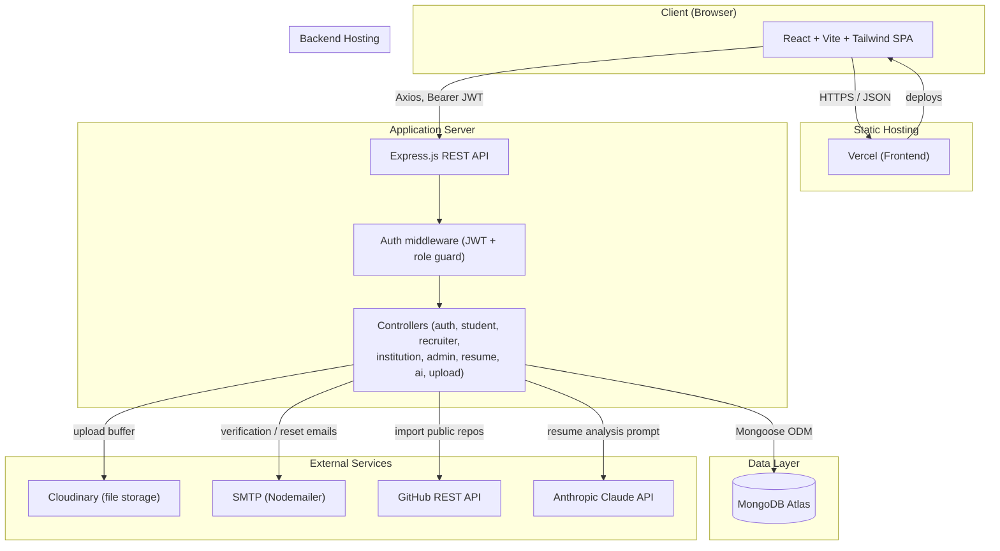
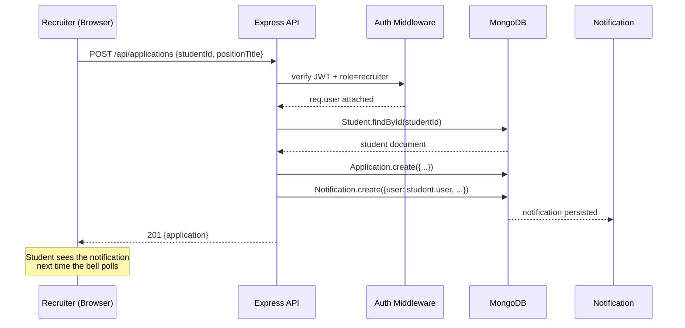

# CareerVerse — System Architecture

## Request lifecycle (example: recruiter shortlists a student)

## Layer responsibilities

| Layer | Responsibility |
|---|---|
| **React SPA** | Routing, forms, client-side auth state (JWT in localStorage), calls REST API via Axios |
| **Express API** | Request validation, JWT verification, role-based authorization, business logic |
| **Mongoose Models** | Schema validation, relationships (ObjectId refs), password hashing hooks |
| **MongoDB Atlas** | Persistent storage |
| **Cloudinary** | Avatar/resume/certificate/project image storage, returns CDN URLs |
| **Nodemailer/SMTP** | Transactional email (verification, password reset) |
| **GitHub REST API** | Public repo import (read-only, no auth required for public repos) |
| **Anthropic Claude API** | Resume scoring, skill-gap detection, career/keyword suggestions |

## Deployment topology

- **Frontend** → static build (`vite build`) deployed to Vercel (or Netlify/any static host)
- **Backend** → Node process deployed to Render (or Railway/Fly.io/any Node host)
- **Database** → MongoDB Atlas (managed, free tier is sufficient for an MVP)
- **File storage** → Cloudinary (managed, free tier sufficient for MVP volume)

No server-side rendering, no separate microservices — this is a single Express monolith
talking to MongoDB, which is the right level of complexity for the current feature set.
Splitting the AI/resume features into a separate service becomes worth considering only if
they need independent scaling or a different runtime (e.g. Python for heavier ML work).
