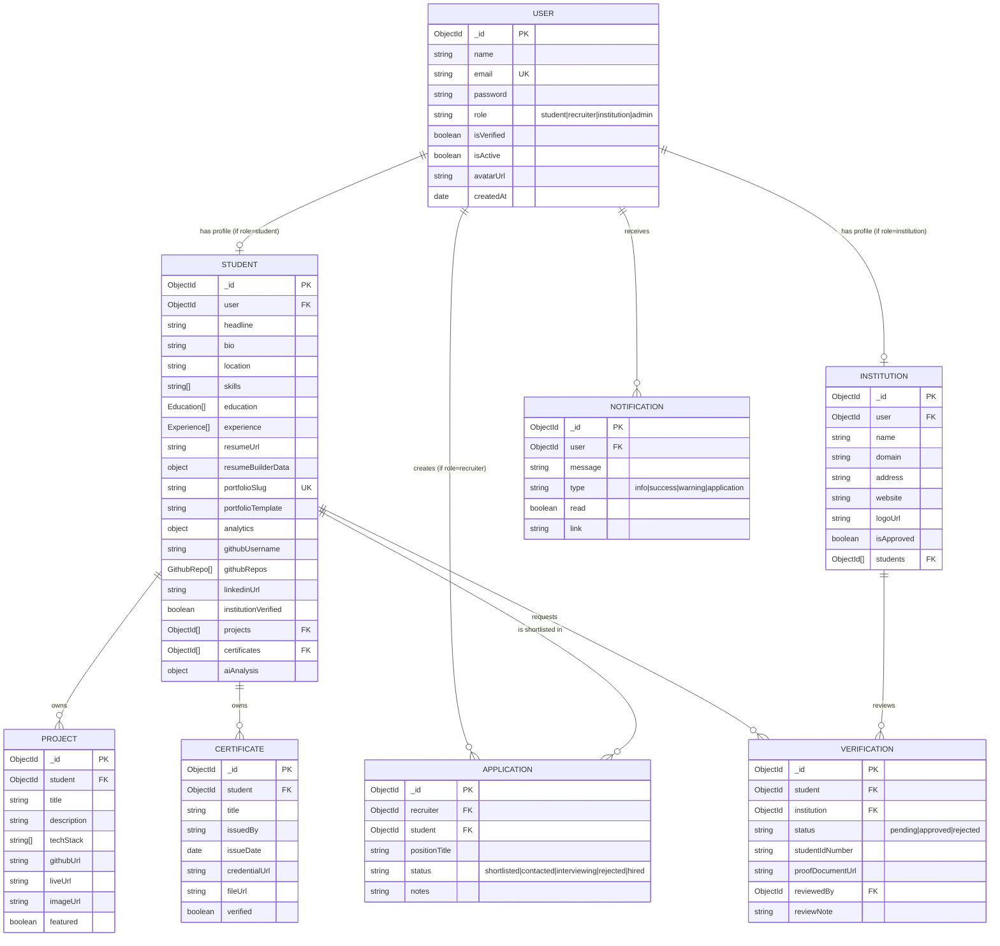

# CareerVerse — Entity Relationship Diagram

This is written in [Mermaid](https://mermaid.js.org) syntax. GitHub, GitLab, and most modern
Markdown viewers render it automatically. You can also paste it into https://mermaid.live to
view/export as an image.

## Notes on relationships

- **User → Student/Institution** is a 1:1 "role profile" pattern: a `User` document holds
  auth/identity, and a separate `Student` or `Institution` document holds role-specific data.
  This keeps the auth model lean and avoids a giant polymorphic schema.
- **Student → Project / Certificate** is 1:many, modeled as an array of ObjectId references
  on `Student` (rather than embedding), since projects/certificates are independently
  queried, updated, and deleted via their own endpoints.
- **Verification** is a join-like model between `Student` and `Institution` that tracks a
  request's lifecycle (pending → approved/rejected) rather than a simple boolean, so the
  audit trail (who reviewed it, when, with what note) is preserved.
- **Application** links a `Recruiter` (a `User` with role=recruiter) to a `Student`, tracking
  shortlist status through a small state machine.
